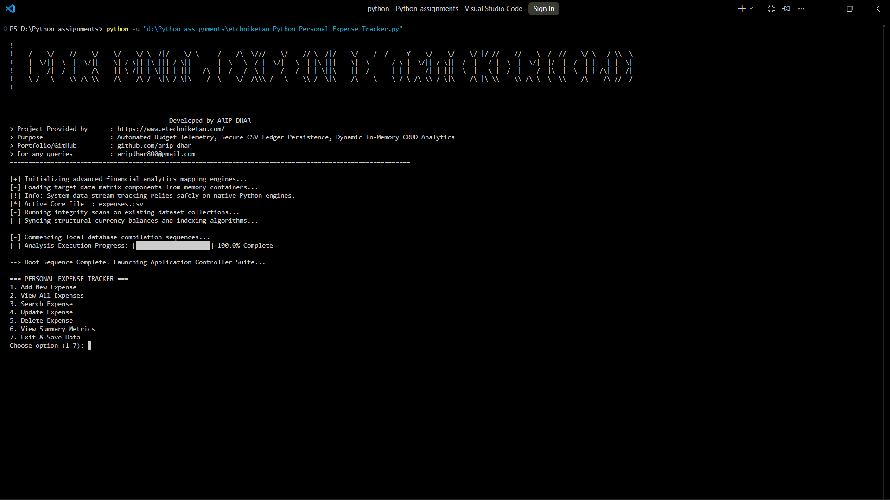
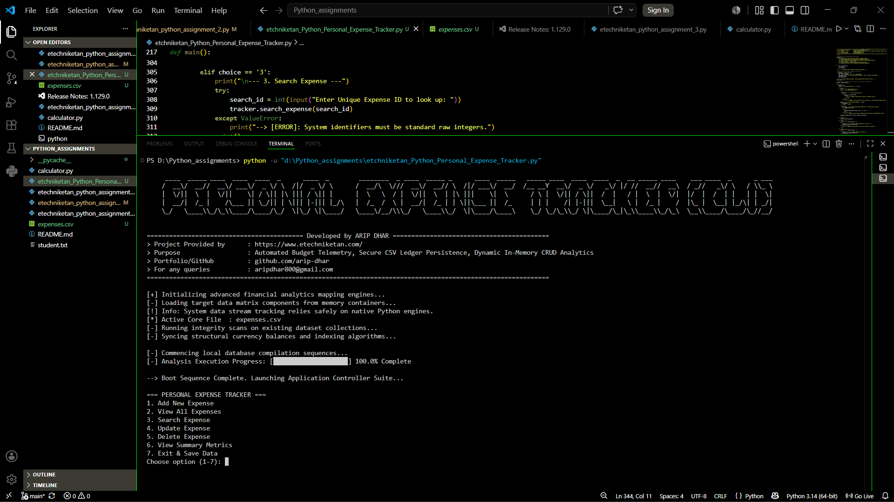
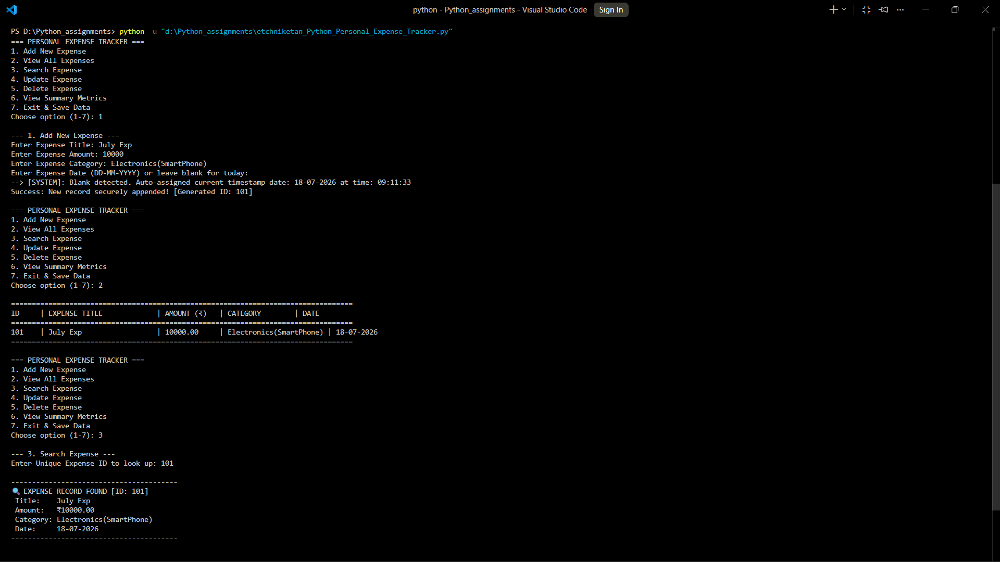
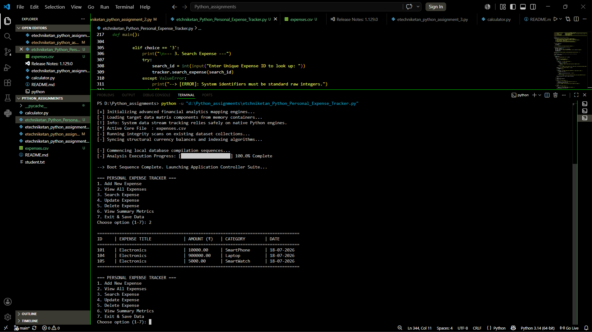
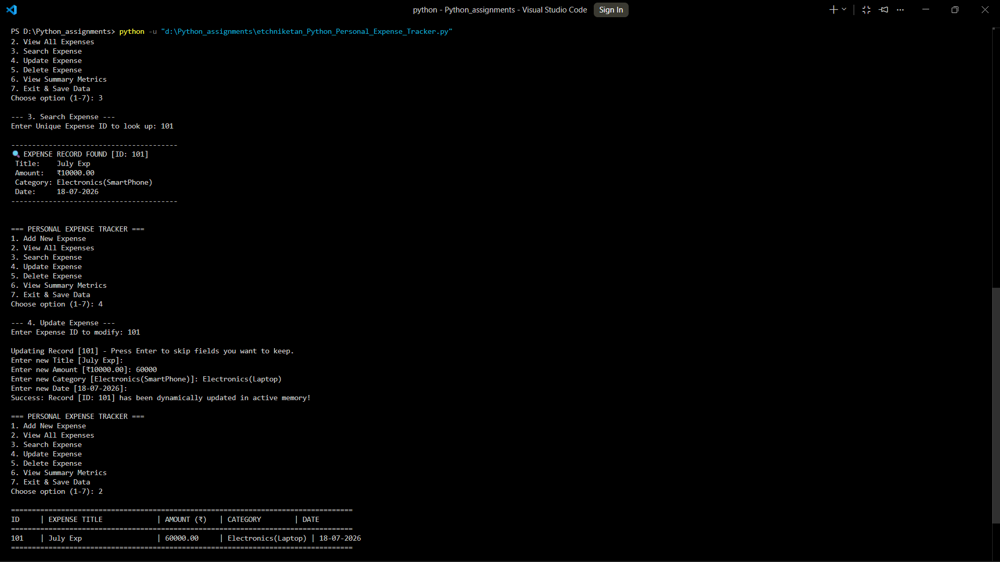
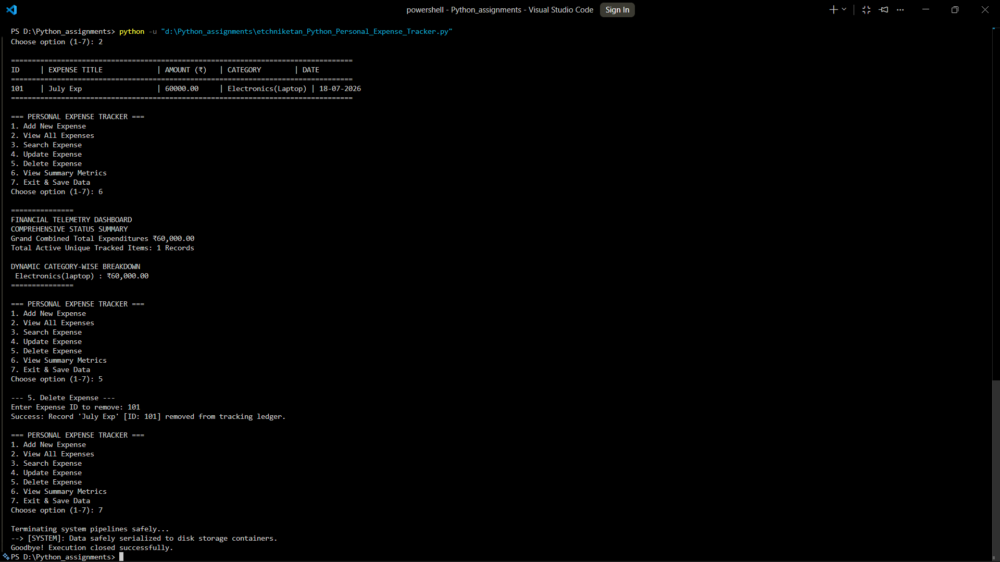
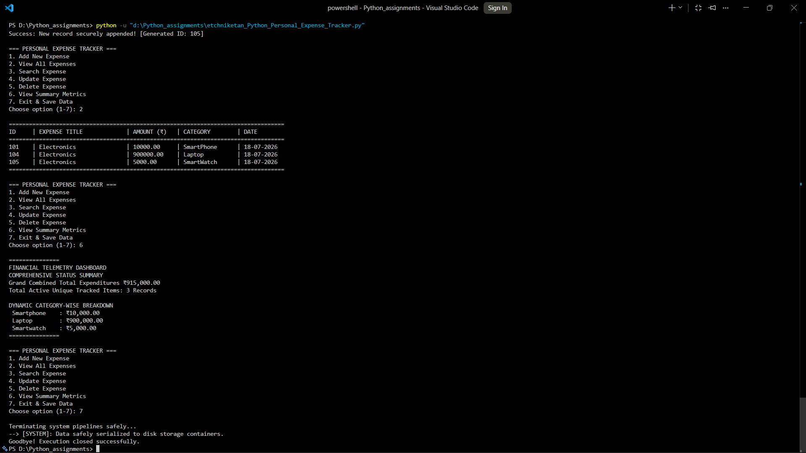
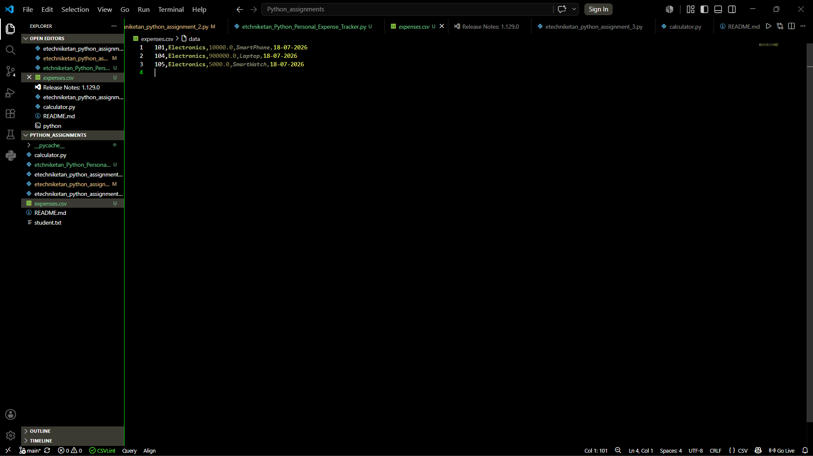

# 💰 Personal Expense Tracker (Python CLI)

> A menu-driven Personal Expense Tracker built in Python that demonstrates file handling, data structures, input validation, and CSV-based persistent storage.


---

## 📌 Overview

This project was developed as the final capstone for my Python programming assignments. It provides a command-line application for managing personal expenses while demonstrating core Python programming concepts such as:

- Object-Oriented Programming
- CSV File Handling
- CRUD Operations
- Exception Handling
- Modular Programming
- Data Validation
- Date & Time Processing

---

# ✨ Features

- ✅ Add Expenses
- ✅ View Expense Ledger
- ✅ Search Expense by ID
- ✅ Update Existing Expense
- ✅ Delete Expense
- ✅ Category-wise Summary
- ✅ Automatic Timestamp Generation
- ✅ CSV Database Storage
- ✅ Robust Input Validation
- ✅ Interactive CLI Interface

---

# 🛠 Tech Stack

| Technology | Purpose |
|------------|----------|
| Python 3 | Core Programming |
| CSV Module | Data Storage |
| Datetime | Timestamp Generation |
| OS Module | Terminal Utilities |
| Custom Modules | Calculator & Utilities |

---

# 📂 Repository Structure

```text
📦 etechniketan_Python_Assignments
│
├── assets/
│   ├── boot_banner.png
│   ├── boot_diagnostics.png
│   ├── add_expense.png
│   ├── tabular_ledger.png
│   ├── search_expense.png
│   ├── update_expense.png
│   ├── delete_expense.png
│   ├── telemetry.png
│   └── csv_database.png
│
├── etchniketan_Python_Personal_Expense_Tracker.py
├── etechniketan_python_assignment_1.py
├── etechniketan_python_assignment_2.py
├── etechniketan_python_assignment_3.py
├── calculator.py
├── expenses.csv
├── student.txt
└── README.md
```

---

# 📷 Application Preview

## 🚀 Boot Screen

<p align="center">

</p>

---

## ⚙ System Diagnostics

<p align="center">

</p>

---

## ➕ Add Expense

<p align="center">

</p>

---

## 📋 Expense Ledger

<p align="center">

</p>

---

## 🔍 Search Expense

<p align="center">

</p>

---

## ✏ Update Expense

<p align="center">

</p>

---

## ❌ Delete Expense

<p align="center">

</p>

---

## 📊 Telemetry Dashboard

<p align="center">

</p>

---

## 💾 CSV Database

<p align="center">

</p>

---

# 🚀 Getting Started

Clone the repository

```bash
git clone https://github.com/arip-dhar/etechniketan_Python_Assignments.git
```

Move into the project directory

```bash
cd etechniketan_Python_Assignments
```

Run the application

```bash
python etchniketan_Python_Personal_Expense_Tracker.py
```

---

# 📖 Learning Outcomes

This repository demonstrates practical knowledge of:

- Python Fundamentals
- File Handling
- Functions
- Modules
- Lists
- Dictionaries
- Loops
- Exception Handling
- CRUD Operations
- CSV Database Management
- Date & Time
- Command Line Applications

---

# 👨‍💻 Author

**Arip Dhar**

Cybersecurity Enthusiast • Python Developer • B.Tech CSE (Cyber Security)

GitHub:
https://github.com/arip-dhar

---

⭐ If you found this project useful, consider giving it a Star.